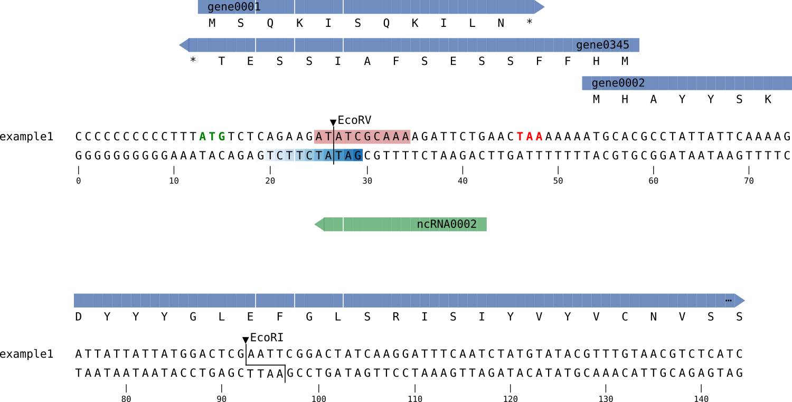

# SeqHighway

SeqHighway is a python library to visualize annotated biological sequences, e.g. from genbank files, in HTML / CSS.



Given a Biopython SeqRecord as input (for example parsed from a genbank file), SeqHighway will generate an HTML representation by using pure HTML/CSS (with optionaly some svg graphics) of the sequence. Annotations such as genes and CDS are represented by colored arrows above the sequence, with a clear layout even when features are overlapping. Translated protein sequence can be optionaly shown below the arrow. Other annotations, such as start codon, motifs, etc, can be overlaid over the sequence by applying a background color or any change in font properties. Restriction sites are shown by drawing a simple line.

## Currently implemented features

- CDS, genes (floating arrows)
- translated protein sequence
- sequence motifs (sequence overlay), with specific z order
- restriction sites
- cropping of the sequence and features
- minus strand
- coordinate system

## Examples of use

```python
import numpy as np
from Bio import SeqIO
from Bio.SeqRecord import SeqRecord
from Bio.Seq import Seq
from Bio.SeqFeature import SeqFeature, FeatureLocation
import seqhighway
from seqhighway import TrackHighway

seq = Seq("CCCCCCCCCCTTTATGTCTCAGAAGATATCGCAAAAGATTCTGAACTAAAAAAATGCACGCCTATTATTCAAAAGATTATTATTATGGACTCGAATTCGGACTATCAAGGATTTCAATCTATGTATACGTTTGTAACGTCTCATCTAGCTCCTAGATTT")
seqrecord = SeqRecord(seq=seq, id='example1')

# Add some CDS features, stop codon feature, ncRNA
seqfeature = SeqFeature(FeatureLocation(13, 16), type='start_codon', strand=+1)
seqrecord.features.append(seqfeature)

seqfeature = SeqFeature(FeatureLocation(13, 49), type='CDS', strand=+1, qualifiers={'locus_tag':'gene0001'})
seqrecord.features.append(seqfeature)
seqfeature = SeqFeature(FeatureLocation(46, 49), type='stop_codon', strand=+1)
seqrecord.features.append(seqfeature)
seqfeature = SeqFeature(FeatureLocation(11, 59), type='CDS', strand=-1, qualifiers={'id':'gene0345'})
seqrecord.features.append(seqfeature)
seqfeature = SeqFeature(FeatureLocation(53, 155), type='CDS', strand=+1,
                        qualifiers={'locus_tag':['gene0293874'], 'id':['gene0002']})
seqrecord.features.append(seqfeature)
seqfeature = SeqFeature(FeatureLocation(100, 118), type='ncRNA', strand=-1,
                        qualifiers={'id':['ncRNA0002']})
seqrecord.features.append(seqfeature)

# Add some score based color map background to some sequence regions
for jscore, j in enumerate(range(19, 30)):
    score = np.arange(-2, 2, 4/13)[jscore]
    seqfeature = SeqFeature(FeatureLocation(j, j+1), type='region_score', strand=-1,
                            qualifiers={'id':'region1', 'score':score, 'z_order':2})
    seqrecord.features.append(seqfeature)

# Add background highlight feature to the sequence
seqfeature = SeqFeature(FeatureLocation(25, 35), type='region2',
                        qualifiers={'id':'region2', 'z_order':1})
seqrecord.features.append(seqfeature)

# Create the SeqHighway
seqhighway = TrackHighway(seqrecord, seqrecord_start=0, xmin=0, xmax=145,
                          show_translation=True, codon_table="Bacterial")
seqhighway.add_coordinates_track(ticks=True)
seqhighway.add_minus_strand('example1')
seqhighway.add_restriction_sites()

mode = 'fixed_table'
html = seqhighway.to_html(mode=mode, table_width=75, css_track_height=1, css_seq_colwidth=0.67, css_base_fontsize=1, css_units='rem')
```

The generated HTML output can be exported to a file,

```python
with open('seqhighway.html', 'wb') as f:
    f.write(html.encode('utf-8'))
```

or can be directly visualized in the output cell of a Jupyter notebook,

```python
from IPython.core.display import HTML, display
display(HTML(html))
```

## Future improvements

- Improvement of arrow graphics (using SVG for example)
- Highlight region of the sequence for all tracks (for example, with background color).
- Spliced coding sequences with introns and exons.
- Sequence alignments.